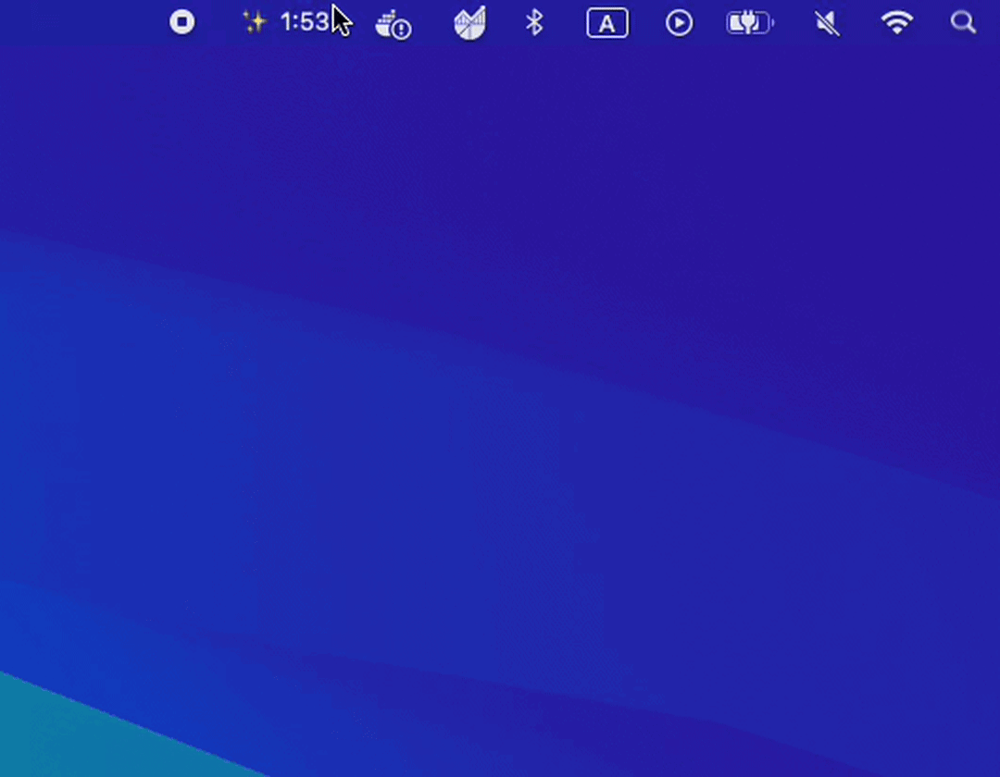
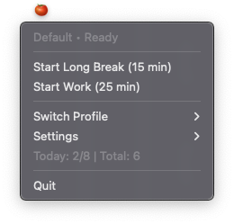
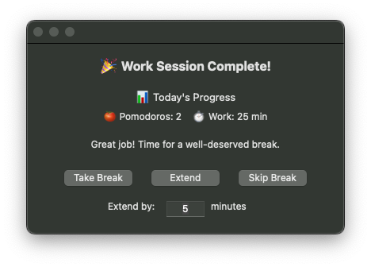
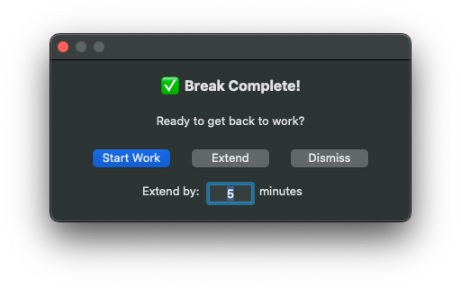

# Pomodoro Timer - macOS Menu Bar App

A minimalist Pomodoro timer that lives in your macOS menu bar.

<p align="center">
  
</p>

### Screenshots

<p align="center">
  
  
  
</p>

## Features

### Core Features

- 🍅 **Menu Bar Only** - Runs exclusively in menu bar (hidden from dock)
- ⏱️ **Real-Time Updates** - Shows seconds with emoji progress indicators
- 🔔 **Smart Notifications** - Native macOS dialogs with sound alerts
- ⚙️ **Timer Profiles** - Multiple customizable timer configurations
- 📊 **SQLite Statistics** - Detailed session tracking with profile names
- 🔒 **Thread-Safe** - Reliable operation with proper synchronization

### Enhanced Features (v1.0)

- **Multiple Timer Profiles** - Switch between different work/break configurations
- **Separate Extend Times** - Different extend durations for work and breaks
- **Enhanced Completion Dialogs** - Native PyObjC dialogs with custom extend input
- **Profile-Based Statistics** - Track sessions per profile
- **Thread Safety** - RLock implementation prevents deadlocks
- **Simplified Menu** - Cleaner interface without redundant time display
- **Session Database** - Track every work and break session with completion status
- **Today's Progress** - View completed pomodoros against daily goal
- **All-Time Statistics** - Total pomodoros, work minutes, and averages
- **Auto-Hide from Dock** - True menu bar app experience
- **Smart Break Management** - Auto-detect short vs long breaks

## Quick Start

### Prerequisites

- macOS 10.15 or later
- Python 3.9+

### Installation

#### Option 1: Use Pre-built App

1. Open the built application:

```bash
open "dist/Pomodoro Timer.app"
```

2. Or drag to Applications folder for permanent installation

#### Option 2: Run from Source

1. Clone the repository:

```bash
cd ~/Projects/pomodoro-timer
```

2. Install dependencies:

```bash
pip3 install -r requirements.txt
```

3. Run the app:

```bash
python3 main.py
```

#### Option 3: Build from Source

```bash
# Build the app bundle
/usr/bin/python3 setup.py py2app

# Run the built app
open "dist/Pomodoro Timer.app"
```

## Usage

1. Click the 🍅 icon in your menu bar
2. Select "Start" to begin a 25-minute work session
3. Take a 5-minute break when prompted
4. After 4 pomodoros, enjoy a 15-minute long break

### Controls

- **Start** - Begin work or break session
- **Pause/Resume** - Pause and resume timer (pause time excluded from duration)
- **Stop** - Stop current session (with confirmation dialog)
- **Extend X min** - Add minutes to current timer (configurable)
- **Skip Break** - Skip break and start next work session
- **Switch Profile** - Choose between different timer configurations
- **Settings** - Configure timers and reset all progress

### Icon States

- **🍅** - Idle/Ready
- **🕐 MM:SS** - Working with clock emoji showing progress
- **☕ MM:SS** - Break with coffee emoji
- **⏸ MM:SS** - Paused

## Configuration

Settings are saved to `~/.config/pomodoro-timer/config.json`

Default configuration:

```json
{
  "timers": {
    "work_minutes": 25,
    "short_break_minutes": 5,
    "long_break_minutes": 15,
    "pomodoros_until_long_break": 4,
    "extend_minutes": 5
  }
}
```

Statistics are stored in SQLite database at `~/.config/pomodoro-timer/stats.db`

Timer state is periodically saved to `~/.config/pomodoro-timer/timer_state.json` for crash recovery

## Development

### Project Structure

```
pomodoro-timer/
├── src/
│   ├── pomodoro_timer.py        # Core timer logic
│   ├── menu_bar_app.py          # Menu bar UI (thread-safe with RLock)
│   ├── config_manager.py        # Configuration with profiles support
│   ├── statistics_db.py         # SQLite database with profile tracking
│   ├── notification_manager.py  # Notifications
│   ├── completion_dialog.py     # Base PyObjC dialog
│   ├── work_completion_dialog.py # Work session completion dialog
│   ├── break_completion_dialog.py # Break completion dialog
│   ├── json_settings.py         # Settings editor
│   └── constants.py             # Constants and paths
├── tests/                        # Test suite
├── dist/                         # Built application
│   └── Pomodoro Timer.app       # macOS app bundle
├── main.py                       # Entry point
├── setup.py                      # py2app configuration
├── SPECIFICATION.md              # Technical docs
└── README.md                     # This file
```

### Running Tests

```bash
python3 -m pytest tests/ -v
```

### Thread Safety Implementation

The application uses threading for timer operations and UI updates:

- **Background Thread**: Runs timer tick operations every second
- **Main Thread**: Handles UI updates and user interactions
- **RLock (Reentrant Lock)**: Prevents deadlocks when nested method calls access timer state
- **Thread-Safe Operations**: All timer state modifications are protected by locks

This architecture ensures:

- No race conditions between timer updates and UI reads
- No deadlocks when dialog callbacks trigger menu updates
- Consistent state across all threads
- Reliable timer operation even during rapid user interactions

## Database Schema

The app tracks all sessions in an SQLite database:

```sql
CREATE TABLE sessions (
  id INTEGER PRIMARY KEY AUTOINCREMENT,
  session_type TEXT NOT NULL,  -- 'work', 'short_break', 'long_break'
  start_time TIMESTAMP NOT NULL,
  end_time TIMESTAMP,
  planned_duration INTEGER NOT NULL,
  actual_duration INTEGER,
  completed BOOLEAN DEFAULT 0,
  extend_count INTEGER DEFAULT 0,
  profile_name TEXT  -- Track which profile was used
);
```

## Building and Distribution

### Build Requirements

- macOS 10.15+
- Python 3.9+
- py2app (`pip3 install py2app`)

### Build Commands

```bash
# Clean previous builds
rm -rf build dist

# Build the application
/usr/bin/python3 setup.py py2app

# The app will be in dist/Pomodoro Timer.app
```

### Installation

1. Build the app using above commands
2. Drag `dist/Pomodoro Timer.app` to your Applications folder
3. Launch from Applications or Spotlight

### macOS Security Warning

If you see "Apple could not verify..." when opening the app:

**Solution 1: Right-Click Method**
1. Right-click on `Pomodoro Timer.app`
2. Select "Open" from the menu
3. Click "Open" in the dialog

**Solution 2: System Settings**
1. After trying to open the app
2. Go to System Settings > Privacy & Security
3. Click "Open Anyway" next to the app name

**Solution 3: Terminal**
```bash
xattr -cr "/Applications/Pomodoro Timer.app"
```

### Crash Recovery

If the app crashes or your computer loses power:
1. On next launch, you'll see a recovery dialog for recent sessions
2. Choose to mark the session as incomplete or delete it
3. Timer state is saved every 30 seconds for accurate recovery

### Known Issues & Fixes

- **Timer Freezing**: Fixed with RLock implementation
- **Dialog Crashes**: Fixed with proper PyObjC button signatures  
- **Float Minute Values**: Fixed with integer conversion
- **Menu Not Updating**: Fixed with proper menu refresh after state changes
- **Pause Time in Duration**: Fixed by tracking actual work time separately
- **Orphaned Sessions**: Fixed with automatic crash recovery on startup

## Version History

- **v1.0.0** (Current) - Production release with all features including profiles, thread safety, statistics, and enhanced UI

## License

MIT License

